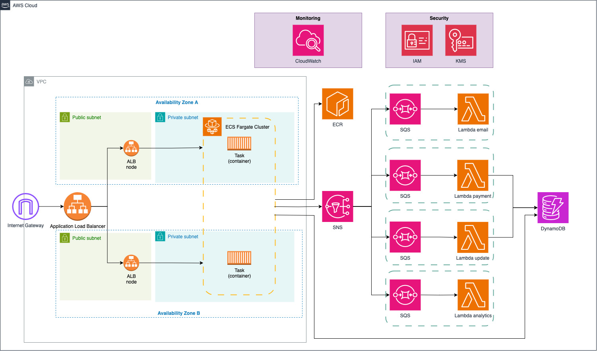

# Hotel-Reservation-Platform

This project provisions a cloud environment using **Terraform** on AWS for Hotel Reservations. It includes a Python web service hosted in ECS Fargate and a message broker powered by SNS + SQS.

---

## 📦 Features

- ✅ Python web service deployed with ECS Fargate
- ✅ SNS Topic + SQS Queues (as Message Broker)
- ✅ DynamoDB (for data persistence)
- ✅ Secure networking (VPC, private subnets, endpoints, IAM, KMS)
- ✅ Logs via CloudWatch
- ✅ Encrypted at rest (DynamoDB)

---

## 🧱 Architecture Overview



---

## 🛠️ Prerequisites

Make sure the following tools are installed and configured:

- ✅ AWS account with admin permissions
- ✅ AWS CLI (`aws configure`)
- ✅ [Terraform](https://www.terraform.io/downloads)
- ✅ [Docker](https://docs.docker.com/get-docker/)

---

## 🚀 Usage

1. Clone the Repository
```bash
git clone
cd ./infrastructure
```

2. Initialize Terraform
```bash
terraform init
```
3. Preview Plan
```bash
terraform plan
```
4.  *🔐 Task Image ECR Setup (First-Time Users)*
- **Create an ECR Repository** (or use Terraform for this)
    ```bash
    terraform apply -target=module.ecr
    ```
- Execute the deploy_ecr.sh script to publish the image
    ```bash
    ./scripts/deploy_ecr.sh
    ```
- Generate the lambda zip files
    ```bash
  cd lambdas
  for f in *_handler.py; do zip "${f%.py}.zip" "$f"; done
    ```
5. Initiate the project
```bash
terraform apply
```

---
## ⚙️ Variables

You can configure all main inputs. Example:

- region           = "eu-west-1"
- cidr_block       = "10.0.0.0/16"
- availability_zones = ["eu-west-1a", "eu-west-1b"]
---
## 🎯 Main Purpose

The idea of this project was to create a solid, scalable foundation for a reservation backend system for hotels.

---
## 🧠 Design Decisions

**Fargate** for lower overhead, and its serverless container nature, serving as the API host.

**Application Load Balancer (ALB)** to serve as the system’s web-facing entry point and balance traffic between tasks across multiple Availability Zones.

**SNS + SQS** (Fan-out architecture) for asynchronous processing and decoupled task execution per endpoint, promoting parallelism, task and error isolation, and better observability

While Fargate executes the synchronous tasks, the rest of the async works is done using Lambda. Each **Lambda** function represents a well-defined functional domain, useful for separations of privilege, consuming messages from its respective **SQS** queue: (Note - some of them are currently placeholders)
- **Payment**: Handles transaction processing and potential reimbursements. Has access to the DynamoDB to update reservation status.
- **Updater**: Intended to manage reservation update events. Has access to the DynamoDB to update reservation status.
- **Email**: Would notify users about booking confirmations, updates, or issues.
- **Analytics**: A placeholder for future aggregation of user activity and event data, potentially useful for visualization or ML pipeline integration.


**DynamoDB** for fast, out-of-the-box scalable NoSQL backend.

**VPC Endpoints** to enable secure service access (e.g., **ECR**, **DynamoDB**) without public internet exposure.


## ⚡️ Features - Endpoints

### /reservation 

Creates a reservation for a specific user
Command to test:
```bash
curl -X POST http://<alb-arn>.<region>.elb.amazonaws.com/reserve \
  -H "Content-Type: application/json" \
  -d '{
    "client_name": "M. Gustave",
    "client_email": "example@gmail.com
    "hotel": "Grand Budapest Hotel",
    "check_in": "2025-07-01",
    "check_out": "2025-07-05"
  }'
  ```
- Returns reservation_id
- The **Fargate** task will create the entry in the **DynamoDB**
- After that, the **email**, **updater**, **payment** & **analytics** tasks will take place
- The **payment** lambda will put the attribute "paid" to true, symbolizing a payed reservation


---
## 🧑‍💻 Future Improvements

- Enable encryption for all services (SNS, SQS, etc.) & better isolation of permission in resources
- Utilize **ACM** to change the HTTP communication to HTTPS
- Place a **WAF** in front of the **ALB** for input sanitation and general web security
- Use email **Lambda** + **SES/SMS** for customer-facing notifications (emails and texts)
- Migrate **DynamoDB** to **RDS/Aurora** for more relational consistency and complex querying
- Replace payment **Lambda** with a **Step Function** to support longer-lived workflows
- **S3** + **Athena** for data analytics
- 